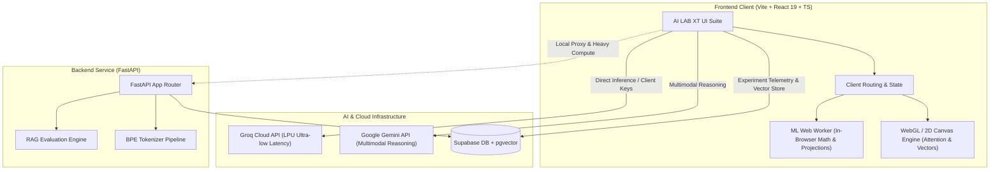

<div align="center">

# AI LAB XT

### **Interactive AI Research, Evaluation & Architecture Laboratory**

[](https://cortexlab-tan.vercel.app)
[](https://react.dev/)
[](https://www.typescriptlang.org/)
[](https://fastapi.tiangolo.com/)
[](https://tailwindcss.com/)
[](https://supabase.com/)
[](LICENSE)

<p align="center">
  <a href="#-why-ai-lab-xt">Why AI LAB XT</a> •
  <a href="#-interactive-laboratories">Laboratories</a> •
  <a href="#-architecture">Architecture</a> •
  <a href="#-tech-stack">Tech Stack</a> •
  <a href="#-project-structure">Project Structure</a> •
  <a href="#-quickstart">Quickstart</a> •
  <a href="#-environment-variables">Environment</a> •
  <a href="#-authors--acknowledgments">Acknowledgments</a>
</p>

---

</div>

## ًںŒگ Live Production Deployment

> **Experience the live suite directly in your browser — no installation required:**
> ًں”— **[https://cortexlab-tan.vercel.app](https://cortexlab-tan.vercel.app)**
> *(No authentication required — instantly explore interactive labs, attention heatmaps, and RAG diagnostics.)*

---

## ًں’، Why AI LAB XT?

Modern generative AI systems are frequently deployed as opaque black boxes. When an LLM hallucinates, a vector search retrieves irrelevant context, or attention degenerates, debugging requires inspecting the underlying mathematics and representations.

**AI LAB XT** is an interactive, browser-native research suite designed to make the internals of modern deep learning and LLM engineering tangible, visual, and quantifiable. It provides real-time telemetry, failure diagnosis, matrix inspection, and mathematical projections for engineers, researchers, and students.

---

## ًں”¬ Interactive Laboratories

### 1. ًں”چ RAG Laboratory & Failure Diagnosis
* **End-to-End Pipeline Simulation:** Ingest documents, chunk text, generate vector embeddings, execute semantic search, and synthesize answers with grounded context.
* **Failure Taxonomy Analysis:** Automatically classifies pipeline errors:
  * **Retrieval Blindspot:** Relevant information exists in raw documents but fell outside Top-K similarity thresholds.
  * **Context Dilution:** Signal lost across excessive or unranked chunks (needle-in-a-haystack degradation).
  * **Parametric Hallucination:** Model introduces non-grounded facts contradicting retrieved sources.
* **Grounding & Faithfulness Scores:** Real-time overlap and citation verification between generated answers and retrieved context passages.

---

### 2. ًں§  Multi-Head Attention Visualizer
* **Self-Attention Heatmaps:** Real-time computation and rendering of the scaled dot-product attention equation.
* **Head Specialization Inspection:** Switch across attention heads and transformer layers to examine syntactic patterns, coreference resolution, and positional decay.
* **Query-Key Interaction Tooltips:** Hover over individual token cells to inspect normalized weights and similarity scores.

---

### 3. ًںŒŒ Semantic Embedding Space (Vector Lab)
* **High-Dimensional Latent Projections:** Interactive 2D and 3D visualization of semantic space using:
  * **PCA (Principal Component Analysis):** Fast linear SVD decomposition preserving global variance.
  * **t-SNE & UMAP:** Non-linear manifold projections revealing semantic clustering.
* **Interactive Dynamic Queries:** Plot arbitrary custom tokens or sentences into the vector space and visualize Euclidean and cosine proximity in real time.

---

### 4. ًں”¤ Byte-Pair Encoding (BPE) Subword Tokenizer
* **Interactive Token Segmentation:** Step-by-step token decomposition showing how strings are partitioned into vocab IDs, subwords, and fallback byte sequences.
* **Compression Ratios & Token Economics:** Compares character length vs. token count, illustrating vocabulary efficiency and billing costs across models.
* **Color-Coded Token Boundaries:** Clear visual delineation of whitespace tokens, punctuation splits, and rare word compounds.

---

### 5. ًںژ›ï¸ڈ AI Playground & Logit Sampling Engine
* **Inference Hyperparameter Tuning:** Temperature, Top-P nucleus sampling, Top-K, and repetition penalties.
* **Provider Switcher:** Seamlessly benchmark identical prompts across **Google Gemini Flash/Pro** and **Groq (Llama-3 8B/70B)**.

---

### 6. ًں“ٹ Real-Time Telemetry & Experiment Tracker
* **Hardware & Provider Benchmarking:** Time-to-First-Token (TTFT), throughput (TPS), and end-to-end latency curves.
* **Experiment Logging:** Persist runs, system prompts, hyperparameter configurations, and evaluation metrics into **Supabase (PostgreSQL)**.

---

## ًںڈ—ï¸ڈ Architecture



---

## ًں› ï¸ڈ Tech Stack

| Domain | Technology | Purpose |
| :--- | :--- | :--- |
| **Frontend Framework** | **React 19** | Modular component architecture with reactive state management |
| **Build & Tooling** | **Vite** | Ultra-fast HMR and optimized production bundling |
| **Type Safety** | **TypeScript 5.x** | Strict end-to-end interface contracts and static typing |
| **Styling & Design System** | **Tailwind CSS** | Sleek dark-mode aesthetic with custom cyan accents & glassmorphism |
| **Client-side Compute** | **Web Workers (`mlWorker.ts`)** | Off-main-thread vector math, PCA projections, and token calculations |
| **Backend & Microservices** | **Python 3.11+ / FastAPI** | High-concurrency async endpoints with Pydantic validation |
| **Database & Vector Engine** | **Supabase (PostgreSQL)** | Persistent experiment tracking and vector indexing with `pgvector` |
| **Model Acceleration** | **Groq LPU & Gemini APIs** | Low-latency LLM inference and state-of-the-art reasoning |
| **CI/CD & Hosting** | **Vercel** | Automated continuous deployment with edge performance |

---

## ًں“‚ Project Structure

```
Ai_Lab/
├── frontend/                     # Modern React + Vite + TypeScript Application
│   ├── public/                   # Static assets, SVG favicons, redirects
│   ├── src/
│   │   ├── components/
│   │   │   ├── attention/        # Transformer attention matrix heatmaps
│   │   │   ├── common/           # Error boundaries, modals, badges
│   │   │   ├── experiments/      # Experiment tracker & metric comparisons
│   │   │   ├── navigation/       # Command palette, responsive sidebar, top bar
│   │   │   ├── overview/         # Dashboard telemetry & laboratory cards
│   │   │   ├── rag/              # RAG pipeline visualizer & failure diagnostics
│   │   │   ├── research/         # Curated research papers & citations
│   │   │   └── system/           # API explorer & documentation viewer
│   │   ├── lib/
│   │   │   ├── algorithms/       # Attention math, PCA, embedding projections
│   │   │   ├── groqClient.ts     # Groq API client integration
│   │   │   ├── mlWorker.ts       # Web Worker for intensive client-side computation
│   │   │   ├── store.ts          # Global state management
│   │   │   └── types.ts          # Strict TypeScript interface definitions
│   │   ├── App.tsx               # Primary application router & layout
│   │   └── main.tsx              # React DOM entrypoint
│   ├── package.json
│   ├── tsconfig.json
│   └── vite.config.ts
│
├── backend/                      # High-performance FastAPI Backend Service
│   ├── app/
│   │   ├── api/                  # API routers & endpoint controllers
│   │   ├── core/                 # App configurations & CORS handlers
│   │   ├── services/             # Supabase client & model proxies
│   │   └── main.py               # FastAPI application entrypoint
│   └── requirements.txt          # Python dependencies
│
└── ml/                           # Dedicated Python ML Tooling
    ├── evaluation/
    │   └── rag_metrics.py        # RAG evaluation (grounding, context precision)
    └── tokenization/
        └── bpe_tokenizer.py      # Custom Byte-Pair Encoding subword implementation
```

---

## âڑ، Quickstart Guide

### Prerequisites
* **Node.js** (v18 or higher) & `npm`
* **Python** (v3.10 or higher) & `pip`
* Free API keys for **Supabase**, **Groq**, and **Google Gemini**

---

### 1. Clone the Repository
```bash
git clone https://github.com/Omar-Alshafai2/ai-lab-xt.git
cd ai-lab-xt
```

### 2. Frontend Setup
```bash
cd frontend
npm install
```

Create a `.env.local` file inside `frontend/`:
```env
VITE_SUPABASE_URL=https://your-project.supabase.co
VITE_SUPABASE_ANON_KEY=your-supabase-anon-key
VITE_GROQ_API_KEY=gsk_your_groq_api_key
VITE_GEMINI_API_KEY=AIzaSy_your_gemini_api_key
```

Run the development server:
```bash
npm run dev
```
> Open your browser to **`http://localhost:5173`** to access AI LAB XT.

---

### 3. Backend Setup (Optional)
```bash
cd ../backend
python -m venv venv

# Windows:
venv\Scripts\activate
# macOS/Linux:
source venv/bin/activate

pip install -r requirements.txt
uvicorn app.main:app --reload --port 8000
```
> Interactive Swagger API docs at **`http://localhost:8000/docs`**.

---

## ًں”گ Environment Variables

| Variable | Scope | Description | Safe for Frontend? |
| :--- | :--- | :--- | :---: |
| `VITE_SUPABASE_URL` | Frontend | Supabase project REST URL | ✅ Yes |
| `VITE_SUPABASE_ANON_KEY` | Frontend | Supabase public anonymous key (RLS enforced) | ✅ Yes |
| `VITE_GROQ_API_KEY` | Frontend | Groq Cloud API key for direct browser inference | âڑ ï¸ڈ Demo/Local |
| `VITE_GEMINI_API_KEY` | Frontend | Google AI Studio Gemini API key | âڑ ï¸ڈ Demo/Local |
| `SUPABASE_SERVICE_KEY` | Backend | Administrative Supabase access (bypasses RLS) | â‌Œ **NEVER** |

---

## ًں‘¨â€چًں’» Authors & Acknowledgments

* **Creator & Lead Engineer:** **[Omar Alshafai](https://github.com/Omar-Alshafai2)**
  * GitHub: [@Omar-Alshafai2](https://github.com/Omar-Alshafai2)
  * Live Suite: [https://cortexlab-tan.vercel.app](https://cortexlab-tan.vercel.app)

* **AI Pair-Programming & Systems Architecture Assistance:**
  * Built and refined with pair-programming support from **[Antigravity](https://deepmind.google/)** by the **Google DeepMind** team.

---

## ًں“„ License

This project is open-source and licensed under the **[MIT License](LICENSE)**. You are free to use, modify, and distribute it for research, educational, and commercial purposes.


