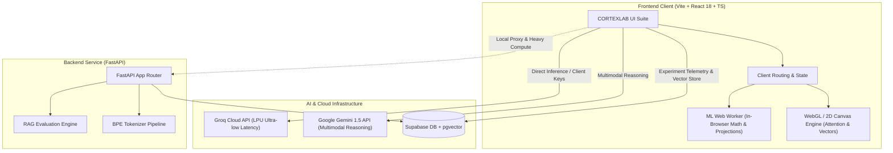

<div align="center">

```
   ______ ____  ____  ______ _______  __ __    ___     ____ 
  / ____// __ \/ __ \/_  __// ____/ |/ // /   /   |   / __ )
 / /    / / / / /_/ / / /  / __/  |   // /   / /| |  / __  |
/ /___ / /_/ / _, _/ / /  / /___ /   |/ /___/ ___ | / /_/ / 
\____/ \____/_/ |_| /_/  /_____//_/|_/_____/_/  |_|/_____/  
```

### **Interactive AI Research, Evaluation & Architecture Laboratory**

[](https://cortexlab-tan.vercel.app)
[](https://react.dev/)
[](https://www.typescriptlang.org/)
[](https://fastapi.tiangolo.com/)
[](https://tailwindcss.com/)
[](https://supabase.com/)
[](LICENSE)

<p align="center">
  <a href="#-why-cortexlab">Why CortexLab</a> •
  <a href="#-interactive-laboratories">Laboratories</a> •
  <a href="#-architecture">Architecture</a> •
  <a href="#-tech-stack">Tech Stack</a> •
  <a href="#-project-structure">Project Structure</a> •
  <a href="#-quickstart">Quickstart</a> •
  <a href="#-environment-variables">Environment</a> •
  <a href="#-authors--acknowledgments">Acknowledgments</a>
</p>

---

</div>

## 🌐 Live Production Deployment

> **Experience the live suite directly in your browser:**  
> 🔗 **[https://cortexlab-tan.vercel.app](https://cortexlab-tan.vercel.app)**  
> *(No authentication required — instantly explore interactive labs, attention heatmaps, and RAG diagnostics).*

---

## 💡 Why CortexLab?

Modern generative AI systems are frequently deployed as opaque black boxes. When an LLM hallucinates, a vector search retrieves irrelevant context, or attention degenerates, debugging requires inspecting the underlying mathematics and representations.

**CortexLab** is an interactive, browser-native research suite designed to make the internals of modern deep learning and LLM engineering tangible, visual, and quantifiable. It provides real-time telemetry, failure diagnosis, matrix inspection, and mathematical projections for engineers, researchers, and students.

---

## 🔬 Interactive Laboratories

### 1. 🔍 RAG Laboratory & Failure Diagnosis
* **End-to-End Pipeline Simulation:** Ingest documents, chunk text, generate vector embeddings, execute semantic search, and synthesize answers with grounded context.
* **Failure Taxonomy Analysis:** Automatically classifies pipeline errors:
  * **Retrieval Blindspot:** Relevant information exists in raw documents but fell outside Top-K similarity thresholds.
  * **Context Dilution:** Signal lost across excessive or unranked chunks (needle-in-a-haystack degradation).
  * **Parametric Hallucination:** Model introduces non-grounded facts contradicting retrieved sources.
* **Grounding & Faithfulness Scores:** Real-time overlap and citation verification between generated answers and retrieved context passages.

---

### 2. 🧠 Multi-Head Attention Visualizer
* **Self-Attention Heatmaps:** Real-time computation and rendering of the scaled dot-product attention equation:
  $$\text{Attention}(Q, K, V) = \text{softmax}\left(\frac{QK^T}{\sqrt{d_k}}\right)V$$
* **Head Specialization Inspection:** Switch across attention heads and transformer layers to examine syntactic patterns, coreference resolution, and positional decay.
* **Query-Key Interaction Tooltips:** Hover over individual token cells to inspect normalized weights and similarity scores.

---

### 3. 🌌 Semantic Embedding Space (Vector Lab)
* **High-Dimensional Latent Projections:** Interactive 2D and 3D visualization of semantic space using:
  * **PCA (Principal Component Analysis):** Fast linear SVD decomposition preserving global variance.
  * **t-SNE & UMAP:** Non-linear manifold projections revealing semantic clustering.
* **Similarity Geometry:** Live vector calculations:
  $$\text{Cosine Similarity} = \cos(\theta) = \frac{\mathbf{u} \cdot \mathbf{v}}{\|\mathbf{u}\|_2 \|\mathbf{v}\|_2}$$
* **Interactive Dynamic Queries:** Plot arbitrary custom tokens or sentences into the vector space and visualize Euclidean and cosine proximity in real time.

---

### 4. 🔤 Byte-Pair Encoding (BPE) Subword Tokenizer
* **Interactive Token Segmentation:** Step-by-step token decomposition showing how strings are partitioned into vocab IDs, subwords, and fallback byte sequences.
* **Compression Ratios & Token Economics:** Compares character length vs. token count, illustrating vocabulary efficiency and billing costs across models.
* **Color-Coded Token Boundaries:** Clear visual delineation of whitespace tokens, punctuation splits, and rare word compounds.

---

### 5. 🎛️ AI Playground & Logit Sampling Engine
* **Inference Hyperparameter Tuning:**
  * **Temperature ($T$):** Controls the entropy of the output logit distribution ($P(w_i) \propto \exp(z_i / T)$).
  * **Top-P (Nucleus Sampling):** Restricts the candidate pool to the smallest set of tokens whose cumulative probability exceeds threshold $P$.
  * **Top-K Sampling & Repetition Penalties.**
* **Provider Switcher:** Seamlessly benchmark identical prompts across **Google Gemini 1.5 Flash/Pro** and **Groq (Llama-3 8B/70B)**.

---

### 6. 📊 Real-Time Telemetry & Experiment Tracker
* **Hardware & Provider Benchmarking:**
  * **Time-to-First-Token (TTFT)**
  * **Throughput:** Tokens per second (TPS)
  * **End-to-End Latency & Cost Curves**
* **Experiment Logging:** Persist runs, system prompts, hyperparameter configurations, and evaluation metrics into **Supabase (PostgreSQL)**.

---

## 🏗️ Architecture



---

## 🛠️ Tech Stack

| Domain | Technology | Purpose |
| :--- | :--- | :--- |
| **Frontend Framework** | **React 18** | Modular component architecture with reactive state management |
| **Build & Tooling** | **Vite** | Ultra-fast HMR and optimized production bundling |
| **Type Safety** | **TypeScript 5.x** | Strict end-to-end interface contracts and static typing |
| **Styling & Design System** | **Tailwind CSS** | Sleek dark-mode aesthetic with custom cyan accents & glassmorphism |
| **Client-side Compute** | **Web Workers (`mlWorker.ts`)** | Off-main-thread vector math, PCA projections, and token calculations |
| **Backend & Microservices** | **Python 3.11+ / FastAPI** | High-concurrency async endpoints with Pydantic validation |
| **Database & Vector Engine** | **Supabase (PostgreSQL)** | Persistent experiment tracking and vector indexing with `pgvector` |
| **Model Acceleration** | **Groq LPU & Gemini APIs** | Low-latency LLM inference and state-of-the-art reasoning |
| **CI/CD & Hosting** | **Vercel** | Automated continuous deployment with edge performance |

---

## 📂 Project Structure

```
Ai_Lab/
├── frontend/                     # Modern React + Vite + TypeScript Application
│   ├── public/                   # Static assets, SVG favicons, redirects
│   ├── src/
│   │   ├── components/
│   │   │   ├── attention/        # Transformer attention matrix heatmaps
│   │   │   ├── common/           # Error boundaries, modals, badges
│   │   │   ├── experiments/      # Experiment tracker & metric comparisons
│   │   │   ├── navigation/       # Command palette, responsive sidebar, top bar
│   │   │   ├── overview/         # Dashboard telemetry & laboratory cards
│   │   │   ├── rag/              # RAG pipeline visualizer & failure diagnostics
│   │   │   ├── research/         # Curated research papers & citations
│   │   │   └── system/           # API explorer & documentation viewer
│   │   ├── lib/
│   │   │   ├── algorithms/       # Attention math, PCA, embedding projections
│   │   │   ├── groqClient.ts     # Groq API client integration
│   │   │   ├── mlWorker.ts       # Web Worker for intensive client-side computation
│   │   │   ├── store.ts          # Global state management
│   │   │   └── types.ts          # Strict TypeScript interface definitions
│   │   ├── App.tsx               # Primary application router & layout
│   │   └── main.tsx              # React DOM entrypoint
│   ├── package.json
│   ├── tsconfig.json
│   └── vite.config.ts
│
├── backend/                      # High-performance FastAPI Backend Service
│   ├── app/
│   │   ├── api/                  # API routers & endpoint controllers
│   │   ├── core/                 # App configurations & CORS handlers
│   │   ├── services/             # Supabase client & model proxies
│   │   └── main.py               # FastAPI application entrypoint
│   └── requirements.txt          # Python dependencies
│
└── ml/                           # Dedicated Python ML Tooling
    ├── evaluation/
    │   └── rag_metrics.py        # RAG evaluation (grounding, context precision)
    └── tokenization/
        └── bpe_tokenizer.py      # Custom Byte-Pair Encoding subword implementation
```

---

## ⚡ Quickstart Guide

### Prerequisites
* **Node.js** (v18 or higher) & `npm`
* **Python** (v3.10 or higher) & `pip`
* Free API keys for **Supabase**, **Groq**, and **Google Gemini**

---

### 1. Clone the Repository
```bash
git clone https://github.com/Omar-Alshafai2/cortexlab.git
cd cortexlab
```

### 2. Frontend Setup
```bash
cd frontend
npm install
```

Create a `.env` file inside `frontend/`:
```env
VITE_SUPABASE_URL=https://your-project.supabase.co
VITE_SUPABASE_ANON_KEY=your-supabase-anon-key
VITE_GROQ_API_KEY=gsk_your_groq_api_key
VITE_GEMINI_API_KEY=AIzaSy_your_gemini_api_key
```

Run the development server:
```bash
npm run dev
```
> Open your browser to **`http://localhost:5173`** to access CortexLab.

---

### 3. Backend Setup (Optional for Local API Proxies)
```bash
cd ../backend
python -m venv venv

# Windows:
venv\Scripts\activate
# macOS/Linux:
source venv/bin/activate

pip install -r requirements.txt
```

Create a `.env` file inside `backend/`:
```env
SUPABASE_URL=https://your-project.supabase.co
SUPABASE_SERVICE_KEY=your-supabase-service-role-key
GROQ_API_KEY=gsk_your_groq_api_key
GEMINI_API_KEY=AIzaSy_your_gemini_api_key
```

Start the FastAPI server:
```bash
uvicorn app.main:app --reload --port 8000
```
> Interactive Swagger API docs will be available at **`http://localhost:8000/docs`**.

---

## 🔐 Environment Variables

| Variable | Scope | Description | Safe for Frontend? |
| :--- | :--- | :--- | :---: |
| `VITE_SUPABASE_URL` | Frontend | Supabase project REST URL | ✅ Yes |
| `VITE_SUPABASE_ANON_KEY` | Frontend | Supabase public anonymous key (RLS enforced) | ✅ Yes |
| `VITE_GROQ_API_KEY` | Frontend | Groq Cloud API key for direct browser inference | ⚠️ Demo/Local |
| `VITE_GEMINI_API_KEY` | Frontend | Google AI Studio Gemini API key | ⚠️ Demo/Local |
| `SUPABASE_SERVICE_KEY` | Backend | Administrative Supabase access (bypasses RLS) | ❌ **NEVER** |

---

## 👨‍💻 Authors & Acknowledgments

* **Creator & Lead Engineer:** **[Omar Alshafai](https://github.com/Omar-Alshafai2)**  
  * GitHub: [@Omar-Alshafai2](https://github.com/Omar-Alshafai2)  
  * Live Suite: [https://cortexlab-tan.vercel.app](https://cortexlab-tan.vercel.app)

* **AI Pair-Programming & Systems Architecture Assistance:**  
  * Built and refined with pair-programming support from **[Antigravity](https://deepmind.google/)** by the **Google DeepMind** team.

---

## 📄 License

This project is open-source and licensed under the **[MIT License](LICENSE)**. You are free to use, modify, and distribute it for research, educational, and commercial purposes.
